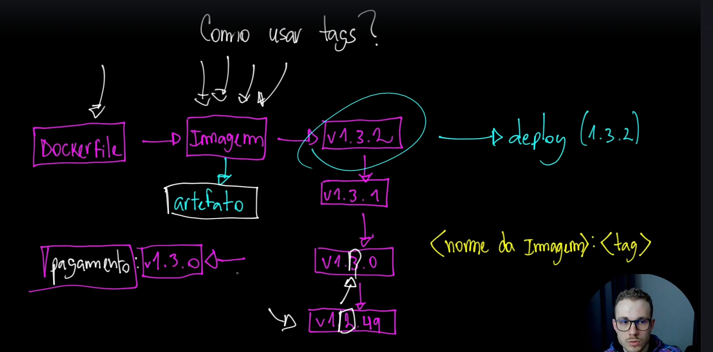
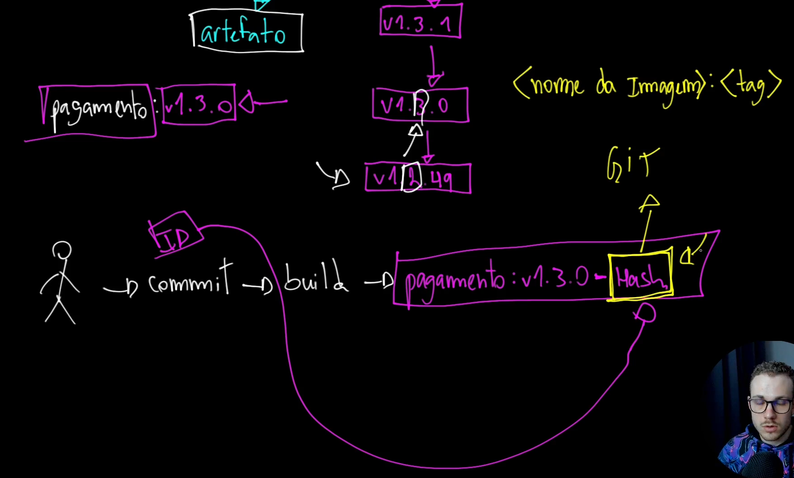

# Curso Docker do Básico ao Avançado

- 15 - Comandos: containers

Para baixar imagem :

```
docker pull nginx:1.21.6-alpine
```

Para rodar a imagem :

```
docker run nginx:1.21.6-alpine
```

para rodar container em mode detach :

```
docker run -d nginx:1.21.6-alpine
```

Exportando a porta :

**Obs**:
Sempre primeiro a porta do host e depois a porta do container

```
docker run -d -p 8080:80 nginx:1.21.6-alpine
```

Verificando status do container :

```
docker container stats
```

Verficando status dos processos:

```
docker container stats
```

Comando exec quando precisa executar algo em um container.


exemplo 1

```
docker exec f4ca ls /

```

exemplo2

```
docker exec f4ca cat  /usr/share/nginx/html/index.html
```

Comando exec atachando o container.

```
docker exec -it f4ca /bin/sh
```

## OverlayFS


Sempre se organize para espaços no armazenamento.

**/var/lib/docker**


FHS sempre é o maior diretorio, ou seja o com o maior numero.


## Redes

Criando uma rede:

```
docker network create demo
```

obs: Nome da rede 'demo'

```
docker network connect demo suspicious_poincare
```

obs: Nome da rede demo e do container `suspicious_poincare`

Criando container direto na rede ja criada.

```
docker run --network demo -it alpine sh
```

Criando um rede com forçando o ip e sem comunicação externa.

```
docker network create --attachable --driver bridge --subnet 192.192.0.0/24 --gateway 192.192.0.1 --ip-range 192.192.0.0/28 --internal internal-demo
```

## Criando network com ips especificos.

```
docker network create -d macvlan --subnet 192.168.122.0/24 --gateway 192.168.122.1 --ip-range 192.168.122.15/32 -o parent=eth0.100 macvlan100
```

# Volumes

## Bind mouting:

Server para montar um diretório ou arquivo do host para o container.

Exemplo de bind :

```
docker run -ti -w /app --mount type=bind,source=$(pwd)/target,target=/app alpine sh
```

Exemplo resumido :

```
docker run -it -w /app  -v /tmp/target:/app alpine sh
```

# Primeiro dockerfile

Criado o docker file

## Build de arquivo diferente do dockerfile padrao.

exemplo :

```
docker build -t python-healthcheck -f Dockerfile.python .
```

# Trabalhando com semantic version no git e no docker :




Resumindo utilizar o no nome da imagem o hash do commit para ter referência
da imagem docker.

# Restart policies

### Tipos de Policies

- no: Não reiniciar automaticamente o contêiner.
  Este é o padrão.

- always: Sempre reiniciar o contêiner, independentemente do código de saída. Útil para serviços que precisam estar sempre ativos.

- on-failure: Reiniciar apenas se o contêiner falhar, ou seja, sair com um código de erro diferente de zero (\(exit\ne 0\)). Também aceita um limite opcional de tentativas,
  ex: --restart=on-failure:5.

- unless-stopped: Reiniciar o contêiner sempre, a menos que ele tenha sido parado manualmente (pelo usuário ou pelo Docker daemon

Para alterar as policies de um container :

Para zerar as policies

```
docker update --restart no hashcontainer
```

```
docker update --restart on-falure
```

# Docker Swarm

## Pontos importantes seguindo boas práticas :

- Ter no mínimo 3 manager

## Projeto vip vs dnsrr

Cria uma rede para projeto

```
docker network create -d overlay --atachable comunidade-devops
```

Inciando o serviço

```
 docker service create --name nginx-service --replicas 3 --endpoint-mode vip --network comunidade-devops nginx:latest
```

Inspecionando as rede

```
docker run --network comunidade-devops -it nicolaka/netshoot sh
```

Escalando o servico:

```
 docker service scale nginx-service=10
```
